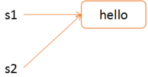
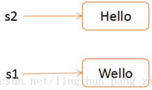

# 一、Linux进程 | fork() 系统调用详解

## 1 fork()函数介绍

fork()用于创建一个子进程，我们在shell下执行一个命令其实也是通过fork()实现的，fork()是Linux下最基本的一个系统调用。<span style="background-color: pink;">fork()最大的特点就是一次调用，两次返回，两次返回主要是区分父子进程，</span>因为fork()之后将出现两个进程，所以有两个返回值，父进程返回子进程ID，子进程返回0。

```c
/* 所需头文件 */
#include <unistd.h>
```

- 在父进程中，fork返回新创建子进程的进程ID；

- 在子进程中，fork返回0；

- 如果出现错误，fork返回一个负值；

```c
/* 函数原型 */
pid_t fork(void);
/* 获取当前进程的 pid 值 */
pid_t getpid();
/* 获取当前进程的父进程pid值 */
```

## 2 fork() 执行过程

用于创建一个进程，所创建的进程复制父进程的 代码段、数据段、BSS段、堆、栈等所有用户信息；在内核中操作系统重新为其申请了一个PCB，并使用父进程的PCB进行初始化；

- 申请PID

- 申请PCB结构

- 复制父进程的PCB

- 将子进程的运行状态设置为不可执行的

- 将子进程中的某些属性清零，某些保留，某些修改

- 复制父进程的页（用到了写时拷贝技术）

- 写实拷贝技术： 父子进程在初始阶段共享所有的数据（全局、 栈区、 堆区、 代码）， 内核会将所有的区域设置为只读。 当父子进程中任意一个进程试图修改其中的数据时， 内核才会将要修改的数据所在的区域（页） 拷贝一份。

画个图就很好理解了：



写时拷贝后：



<span style="background-color: pink;">如果数据没有被修改，子进程和父进程共享数据段，但是如果数据被修改后，内核会拷贝修改一份新的内存区域。</span>

<span style="background-color: pink;">变量的地址是相同的，但是实际指向的物理内存区域是不一样的，这和建立映射关系的页表有关</span>

## 3 分析示例程序

示例程序在 [01_fork.c](./01_fork)

```c
for (i = 0; i < 2; i++) {
  pid_t fpid = fork();
  if (fpid == 0 ){ /* 子进程 */
    printf ("i = %d Child %4d->%4d %4d\n", i, getppid(), getpid(), fpid);
  } else if(fpid > 0) {  /* 父进程返回子进程PID */
    printf ("i = %d Parent %4d->%4d %4d\n", i, getppid(), getpid(), fpid);
  } else {
    perror ("creat process error\n");
  }
}
```

输出结果：

```sh
i = 0 Parent 9067->15779 15780
i = 0 Child 15779->15780    0
i = 1 Parent 9067->15779 15781
i = 1 Child 15779->15781    0 # 子进程
i = 1 Parent 1951->15780 15782
i = 1 Child 15780->15782    0 # 子进程
```

#### 当 i = 0 的时候

1. 9067（终端进程）创建了 父进程15779 (15779->15781)
2. 15779（父进程）创建了 子进程15780 （15780->15782）

#### 当 i = 1 的时候

3. 15779进程创建了15781进程
4. 15780进程创建了15782进程

### 注意

当 i = 1 时候，由于15779(main函数主进程运行完毕)，所以此时15780的父进程被修改父系统进程。

## 参考
[Linux系统——fork()函数详解(看这一篇就够了！！！)](http://www.360doc.com/content/23/0331/09/71858349_1074472516.shtml)