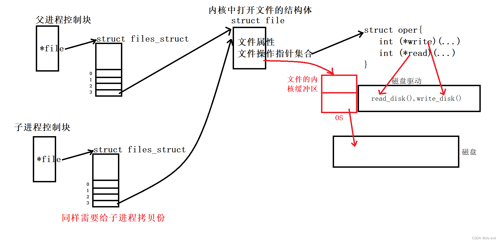

# 二、管道通信

管道通信分为两种，一种是 `匿名管道`，另一种是 `命名管道`

## 1 匿名管道

我们从父子进程开始，父子进程是两个独立的进程，所以父子通信也属于进程间通信，匿名管道就是基于父子进程。

### 为什么struct file_struct要拷贝一份，而struct file不需要拷贝一份？

1. struct file_struct是属于进程PCB的，而且也包含了大量的数据。

2. 如果共用一个struct file_struct，父进程进行读写文件，会被子进程看到，不能做到独立性

struct file 则不需要重新拷贝一份，因为文件是被进程打开了，但是进程与文件之间只有关联关系，不具备拥有关系，这个 struct file属于文件部分的内容和创建进程没有关系，但是子进程继承的struct file_struct是以父进程为模板的，所以父子进程指向同一个文件。

### 进程调用文件操作的原理

当调用系统的读写方法的时候，不是直接写入到磁盘中，OS会开辟一段文件的内核缓冲区，eg:调用write方法时，除了调用底层对应的写方法还会把内容写到了文件的内核缓冲区中，同时这个文件的内核缓冲区也必须被struct file 找到，然后OS定期把数据更新到磁盘中。实际上这个write只做了两件事情。

1. 拷贝数据从用户到内核 

2. 触发底层的写入函数。

### 父子进程间的公共资源struct file

现在父子进程看到了一份公共资源，这个公共资源就是文件struct file.如果父进程将自己的数据写入到了对应缓冲区中不刷新磁盘，那么子进程就可以通过fd找到同一个struct file读取到这个缓冲区的数据，此时就可以做到将一个进程的数据交给下一个进程，这就叫做让不同进程看到同一份资源，这种基于文件的通信方式就叫做管道。说白了就是两个进程可以看到同一个文件，文件里面有缓冲区，一个进程向文件缓冲区中写数据，另一个进程向文件缓冲区中读数据，就完成了通信。

文件不属于进程，而是和进程同样属于内核的数据结构，和进程相关，OS帮助不同进程看到同一分资源。

### 站在文件描述符角度-深度理解管道

将刚刚的图片简化一下

示例代码  [02_pipe_read_write.c](./02_pipe_read_write.c)

#### 四种情况

- 读端不读或者读的慢，写端要等读端

- 读端关闭，写端收到SIGPIPE信号直接终止

- 写端不写或者写的慢，读端要等写端

- 写端关闭，读端读完pipe内部的数据然后再读，会读到0，表明读到文件结尾

#### 五个特点

- 管道是一个只能单向通信的的通信信道。

- 管道是面向字节流的。

- 仅限于父子间通信（具有血缘关系的进程进行进程间通信，常用于进程间通信）。

- 管道自带同步机制。指的的读端可能读写端，写端也可能在等读端，读取不会出现新老数据覆盖的问题。

- 管道的声明周期是随进程的（管道是文件，文件被当前进程打开，相关进程退出了，被打开的文件会被OS自动关闭 ）

## 2 命名管道

示例代码  [02_named_pipes_server.c](./02_named_pipes_server.c) 和  [02_named_pipes_client.c](./02_named_pipes_client.c)

- **连接类型**：可以在不相关的进程之间使用，即它们不需要有父子关系。

- **持久性**：即使没有任何进程在使用它们，它们也能存在于系统中。

- **命名**：它们有一个名称，可以在文件系统中找到并被不同进程访问。

- **方向性**：可以是全双工的，允许数据双向流动。

- **作用域**：可以用于网络中的不同计算机之间（依赖于实现和配置）。

## 参考

[Linux之进程间通信：https://blog.csdn.net/qq_52433890/article/details/125101333#t21](https://blog.csdn.net/qq_52433890/article/details/125101333#t21)